  <h1 align="center">Deep Learning enhanced Ultrasensitive Eu-Based MOF Luminescence Senser for Clenbuterol Visible Recognition</h1>

  
Lan Duo*, Yuze Hao*, Chuanbao Jiao and Xiaomin Kang†

  
College of Chemistry and Chemical Engineering, Inner Mongolia University, Hohhot 010021, China.

This project develops a comprehensive framework for the rapid detection of Clenbuterol (Ractopamine) concentrations in wastewater. By leveraging image processing (RGB feature extraction) and various machine learning/deep learning algorithms, the system achieves precise quantitative analysis and prediction.

## Table of Contents
- [Data Preprocessing](#data-preprocessing)
- [Feature Engineering](#feature-engineering)
- [Clustering Models](#clustering-models)
- [Multivariate Regression](#multivariate-regression)
- [Deep Learning Models](#deep-learning-models)
    - [Multi-Layer Perceptron (MLP)](#multi-layer-perceptron-mlp)
    - [ResNet with Multi-Head Attention](#resnet-with-multi-head-attention)
- [Summary of Findings](#summary-of-findings)

---

## Data Preprocessing
The initial dataset consists of RGB values extracted from images via a mobile application. To understand the data distribution, statistical analysis including violin plots and box plots were generated for the R, G, B, and C features.

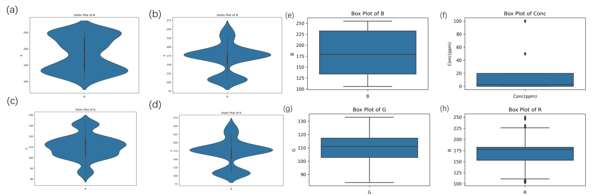  
*Figure 1: (a-d) Violin plots showing attribute distribution; (e-h) Box plots showing medians, quartiles, and outliers.*

## Feature Engineering
Due to the high variance in RGB attributes which could negatively impact model training, data standardization was performed using `scikit-learn`. The values were scaled from the [50, 230] range to near 0, ensuring all features are on the same magnitude while preserving the underlying distribution.

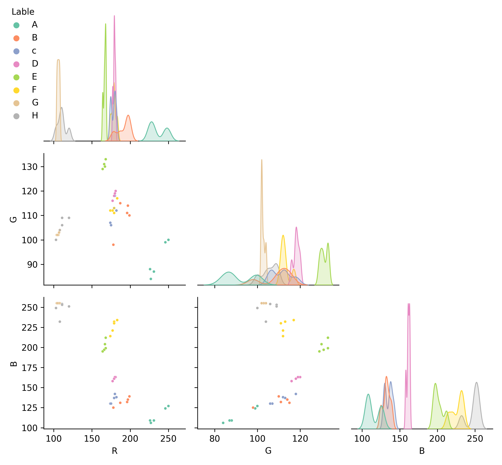  
*Figure 2: Scatter plot matrix of RGB features and statistical distribution of labels.*

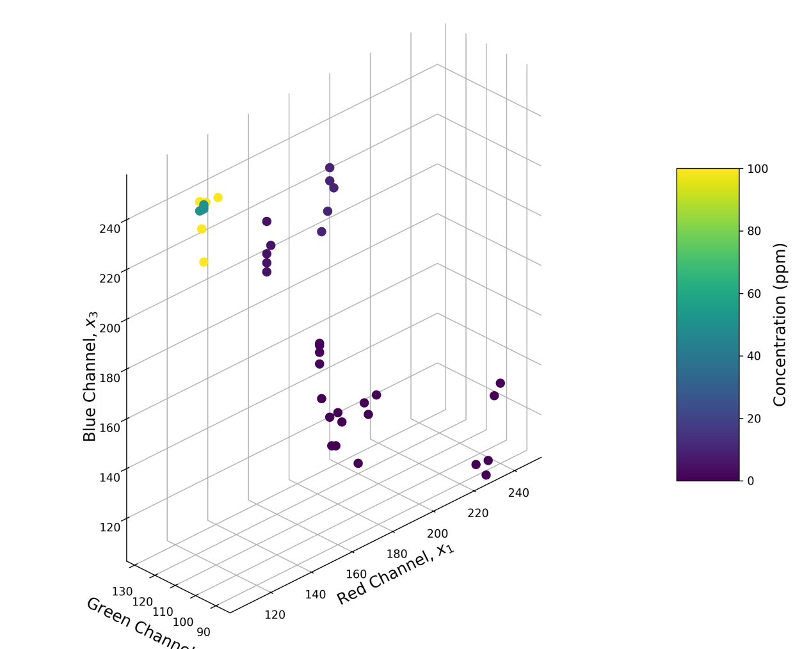  
*Figure 3: 4D scatter plot where X, Y, Z axes represent RGB values and color indicates concentration.*

## Clustering Models
To improve detection accuracy over single-signal comparison, unsupervised learning models were employed:
* **K-means & PCA:** Achieved a coefficient of determination above 0.6.
* **Hierarchical Clustering Analysis (HCA):** Used to identify samples with similar concentration characteristics.
* **Silhouette Coefficient:** Reached approximately 0.65, indicating well-defined clusters.

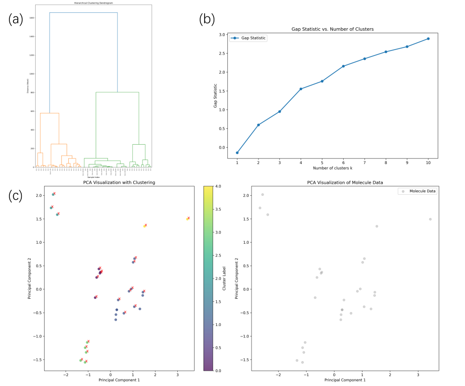  
*Figure 4: (a) HCA dendrogram; (b) Gap statistic for optimal clusters; (c) PCA clustering results.*

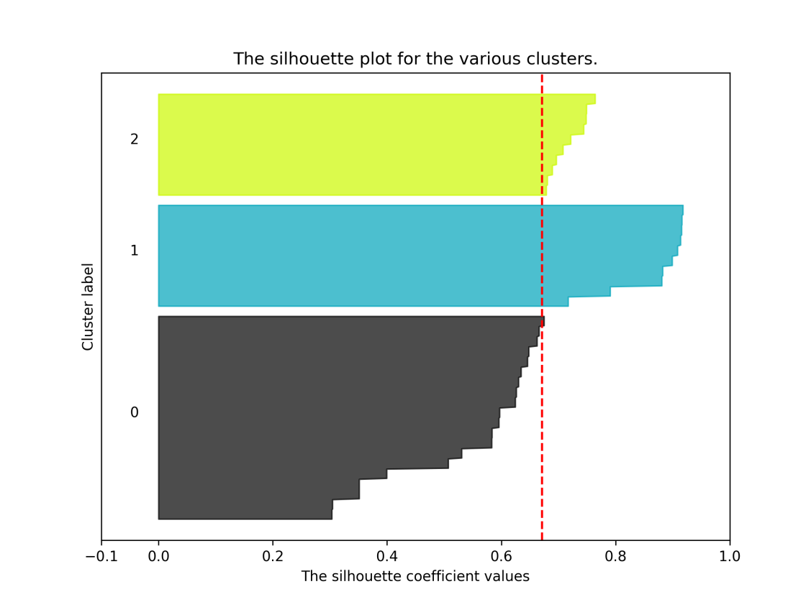  
*Figure 5: Silhouette coefficient plot.*

## Multivariate Regression
A Multivariate Linear Regression model was built to quantify Clenbuterol concentration.
* **Pearson Correlation:** Calculated to understand the linear relationship between features.
* **Assumptions Testing:** Verified through residual linearity and normality tests (Q-Q plots).

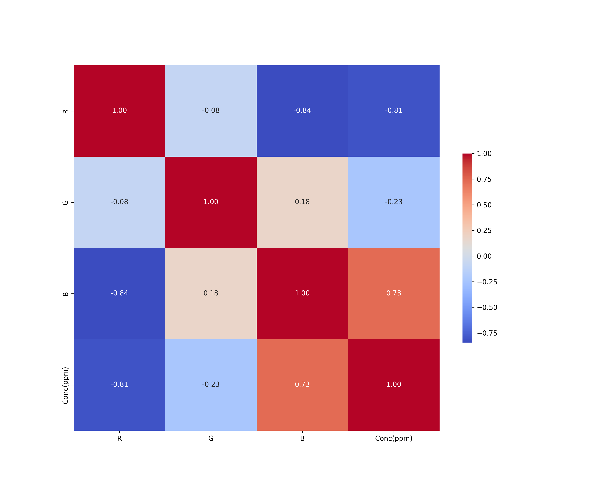  
*Figure 6: Pearson correlation heatmap between RGB values and concentration.*

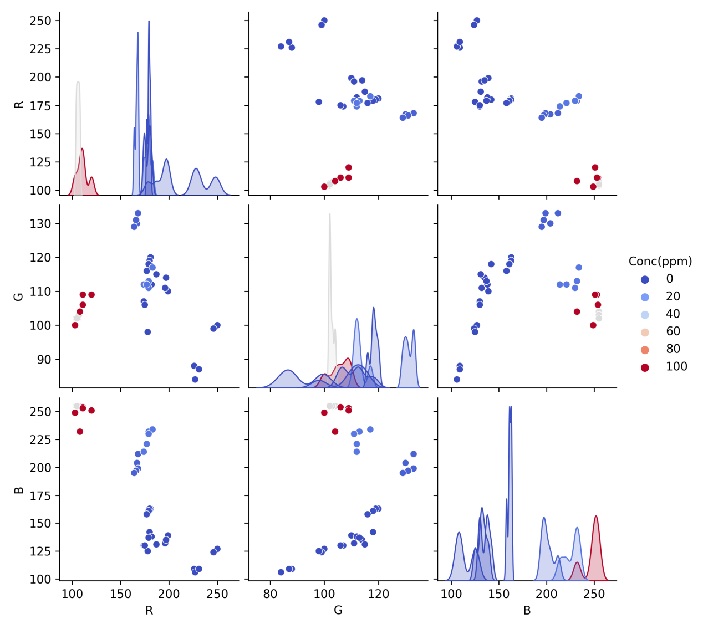  
*Figure 7: Scatter plot matrix showing linear relationships between variables.*

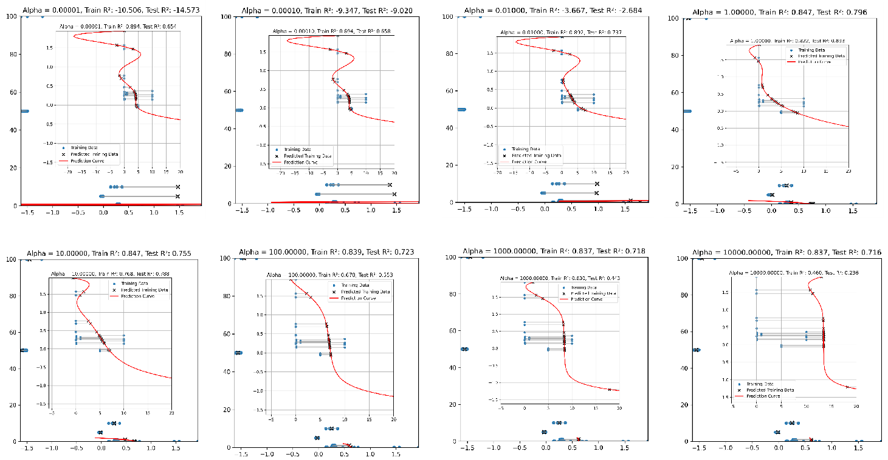  
*Figure 8: Training results of multivariate linear regression models with 8 different alpha values.*

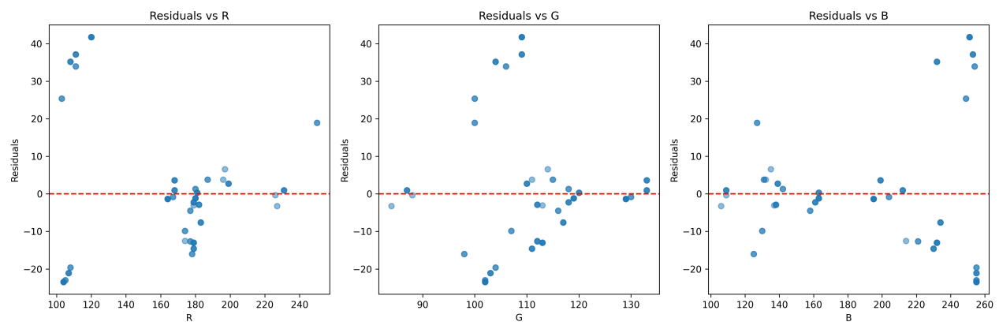  
*Figure 9: Linear relationship between independent variables and residuals.*

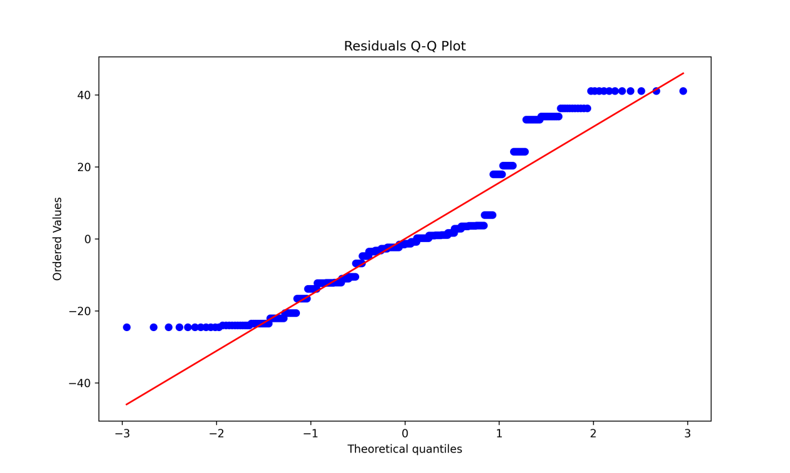  
*Figure 10: Normal Q-Q plot for residual diagnostics.*

## Deep Learning Models

### Multi-Layer Perceptron (MLP)
A Feed-forward Neural Network was implemented using a 4:1 train-test split. The model achieved a coefficient of determination above 0.9 on both sets, demonstrating high precision.

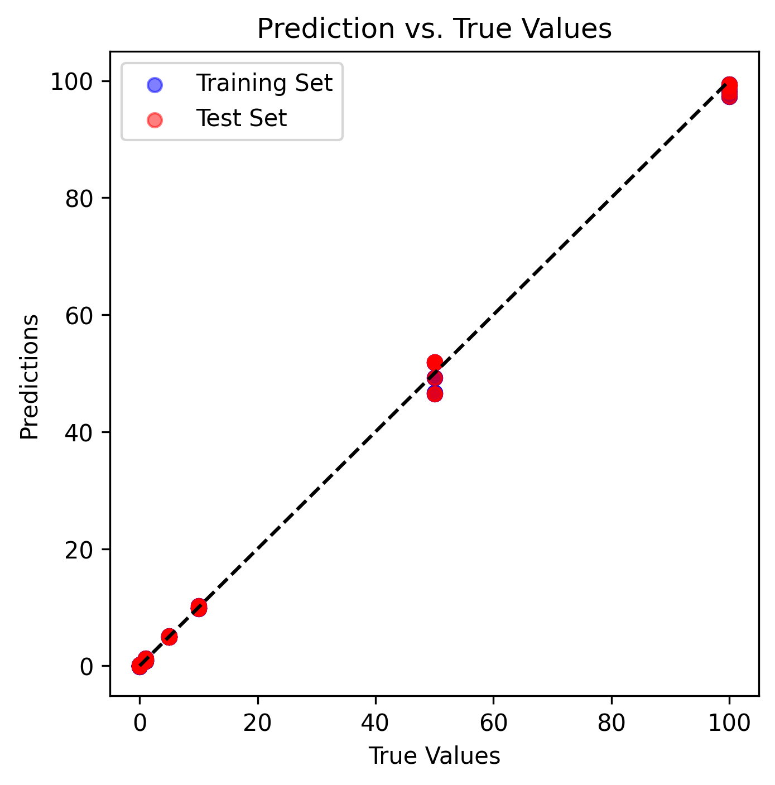  
*Figure 11: Fitting curves for true vs. predicted values in MLP training and testing sets.*

### ResNet with Multi-Head Attention
A ResNet architecture was adapted for this detection task. In addition to high accuracy (R² > 0.9), **Permutation Importance** was calculated using PyTorch to interpret the model.

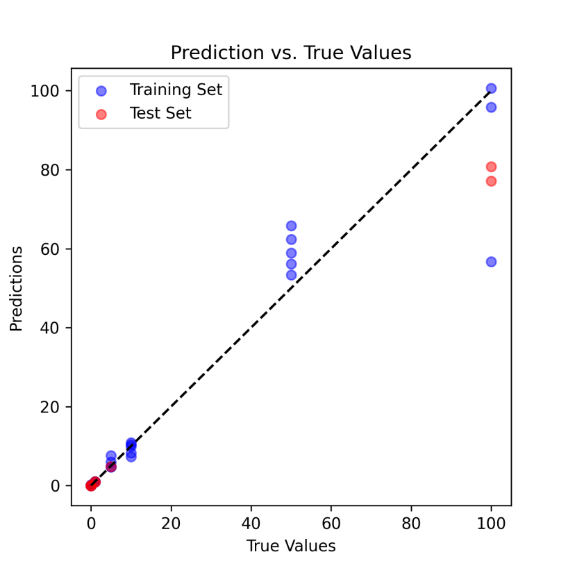  
*Figure 12: ResNet fitting curves for true vs. predicted values.*

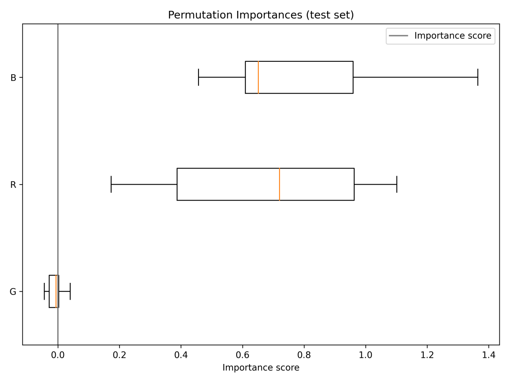  
*Figure 13: Feature importance ranking showing the significance of B and R values over G.*

## Summary of Findings
This project demonstrates that combining fluorescence image RGB analysis with machine learning provides a rapid, low-cost method for Clenbuterol detection. While clustering offers a rough range, deep learning models (MLP and ResNet) provide accurate quantitative predictions, with feature importance analysis further optimizing the detection process.
